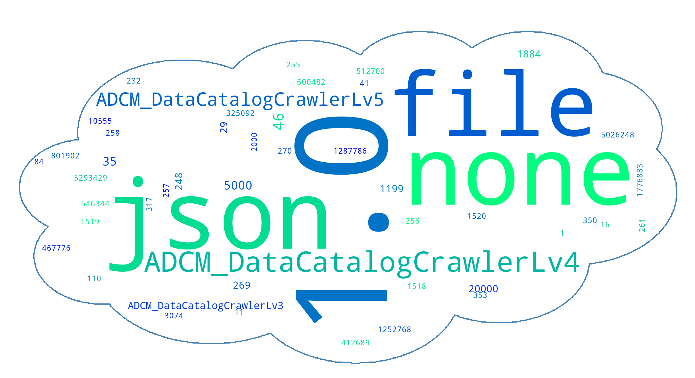
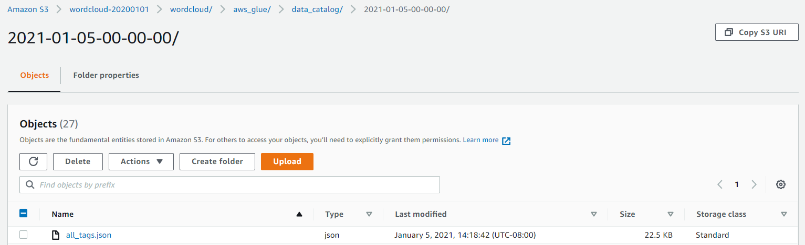

# Wordcloud Generator: AWS Glue Data Catalog tags using Serverless Framework (Python 3)
Do you know tag trends in your data catalog? This tool appear the tag trend on wordcloud.



## Index
<!-- TOC -->

- [Wordcloud Generator: AWS Glue Data Catalog tags using Serverless Framework (Python 3)](#wordcloud-generator-aws-glue-data-catalog-tags-using-serverless-framework-python-3)
  - [Index](#index)
- [How to deploy](#how-to-deploy)
  - [Setup: AWS Credentials on your PC](#setup-aws-credentials-on-your-pc)
  - [Setup: Serverless Framework on your PC](#setup-serverless-framework-on-your-pc)
  - [git clone](#git-clone)
  - [Update: config](#update-config)
  - [Create AWS Lambda Layer for wordcloud](#create-aws-lambda-layer-for-wordcloud)
  - [Create a service directory](#create-a-service-directory)
  - [Deploy a service](#deploy-a-service)
  - [Debug: Create & Delete AWS Budget](#debug-create--delete-aws-budget)
  - [Delete a service](#delete-a-service)
  - [Deployment logs](#deployment-logs)
- [Check: AWS Console](#check-aws-console)
  - [AWS S3](#aws-s3)

<!-- /TOC -->

# How to deploy

## Setup: AWS Credentials on your PC
```
$ cat ~/.aws/credentials 
[default]
aws_access_key_id= [Your ID]
aws_secret_access_key= [Your Key]
aws_session_token= [Your Token]
region= [Your AWS Region (eg: us-east-1)]
```

## Setup: Serverless Framework on your PC
```
$ python -V
Python 3.7.9

$ pip3 -V
pip 9.0.3 from /usr/lib/python3.7/site-packages (python 3.7)

$ npm -v
6.14.8

$ npm install -g serverless
...

$ sls -v
Framework Core: 2.17.0
Plugin: 4.4.1
SDK: 2.3.2
Components: 3.4.3
```

## git clone
```
$ git clone https://github.com/YuyaIsoda/aws-lambda-wordcloud.git
```

## Update: config
Please **MUST** set:
- **Region**: AWS Region Name
- **Bucket**: AWS Acount ID

```
$ cat aws-lambda-wordcloud/conf/sls_conf
# Serverless Framework: Settings
export ServiceName='aws-lambda-wordcloud'
export SLSDIR='serverless'
export Region='us-east-1'
export Stage='dev'

# Environment variable
export Bucket='wordcloud-20200105' # AWS S3 Bucket Name
export WCMask='cloud' # Mask img for wordcloud
```

## Create AWS Lambda Layer for wordcloud
Please find **"LayerVersionArn"**.

```
$ cd aws-lambda-wordcloud/layer
$ sh aws_lambda_layer_wordcloud.sh
...
{
    "LayerVersionArn": "arn:aws:lambda:us-east-1:xxxxxxxxxx:layer:wordcloud:1", 
    "Description": "packages: six, cycler, python-dateutil, pyparsing, kiwisolver, numpy, matplotlib, pillow, wordcloud", 
    "CreatedDate": "2021-01-05T21:48:27.206+0000", 
    "LayerArn": "arn:aws:lambda:us-east-1:xxxxxxxxxxx:layer:wordcloud", 
    "Content": {
        "CodeSize": 34184563, 
        "CodeSha256": "o5BXXdwUkJJC/Kxxxxxxxxxxxxxxxxxxxx", 
        "Location": "https://prod-04-2014-layers.s3.us-east-1.amazonaws.com/snapshots/xxxxxxx"
    }, 
    "Version": 1, 
    "CompatibleRuntimes": [
        "python3.6", 
        "python3.7"
    ]
}
```

Update AWS Lambda Layer (functions.create.layers) in serverless.yml.
```
$ cd ~/aws-lambda-wordcloud/src
$ vi serverless.yml
service: ${env:ServiceName}
frameworkVersion: '2'
...

functions:
  create:
    handler: handler.m_create_wordcloud
    description: 'Create WordCloud'
    environment: ${self:custom.environment.${self:provider.stage}}
    layers:
      - 'arn:aws:lambda:us-east-1:xxxxxxxxxx:layer:wordcloud:1'
    events:
      - schedule: cron(0 9 ? * MON-FRI *)
```

## Create a service directory
```
$ cd aws-lambda-wordcloud/common/
$ sh sls_create.sh
...
/home/ec2-user/serverless/aws-lambda-wordcloud
|--aws_common.py
|--env
|  |--dev.yml
|  |--prod.yml
|--.gitignore
|--handler.py
|--h_conf.py
|--h_wordcloud.py
|--mask
|  |--cloud.png
|  |--comment.png
|  |--database.png
|  |--mask_img.pptx
|--serverless.yml
|--sls_conf
|--sls_create.sh
|--sls_deploy.sh
|--sls_install.sh
|--sls_remove.sh
```

## Deploy a service
```
$ cd ~/serverless/aws-lambda-wordcloud/
$ sh sls_deploy.sh 
...
Service Information
service: aws-lambda-wordcloud
stage: dev
region: us-east-1
stack: aws-lambda-wordcloud-dev
resources: 17
api keys:
  aws-lambda-wordcloud: xxxxxxxxxxxxxxxxxxxxxxxxxxxxxx
endpoints:
  POST - https://xxxxxxx.execute-api.us-east-1.amazonaws.com/dev/wordcloud
functions:
  create: aws-lambda-wordcloud-dev-create
layers:
  None
```

## Debug: Create & Delete AWS Budget
```
$ cd ~/serverless/aws-lambda-wordcloud/
$ source bin/activate
$ source sls_conf

$ sls invoke -f create --log
... (No Error)
```

## Delete a service
```
$ cd ~/serverless/aws-lambda-wordcloud/
$ sh sls_remove.sh 
...
```

## Deployment logs
```
$ ll ~/serverless/log/
...
```

# Check: AWS Console
## AWS S3

